# The Illustrated Recurrence: From Amari-Hopfield Nets to GPT-6 Astra
## Some notes on recurrence in machine learning by Günter Klambauer, September 2026

<figure id="fig-overview">
  <a href="weight-sharing-axes6.svg" target="_blank" rel="noopener">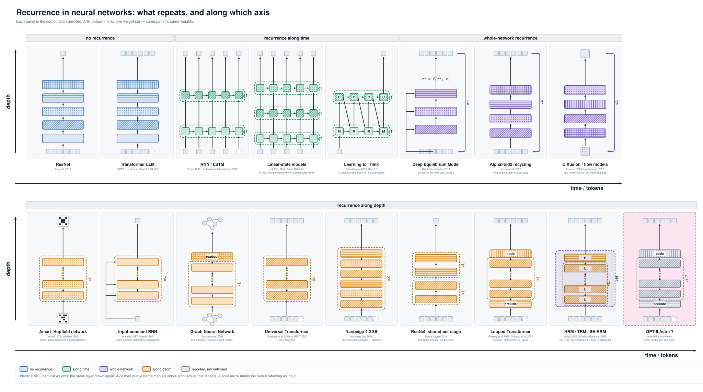</a>
  <figcaption><b>Figure 1: Recurrence in neural networks, sorted by what repeats and along which axis.</b> Each of the 17 panels shows one architecture with its computation unrolled, from the input (bottom) to the output (top). The top row contains architectures without recurrence (blue), with recurrence along time (green), and with whole-network recurrence (purple). The bottom row contains architectures with recurrence along depth (orange). An identical fill pattern marks identical weights, i.e. the same layer drawn again. A dashed frame with ×T or ×L marks a loop with shared weights over time or depth. A purple arrow on the right marks an output that returns as input. The grey panel with a pink background (GPT-6 Astra) is based on an unconfirmed report. Most production LLMs belong to the first group, while the architectures that exploit recurrence most belong to the bottom row.</figcaption>
</figure>

I have noticed that **recurrence keeps getting reinvented** or at least **used in various forms** in machine learning and artificial intelligence. The basic form of recurrence is:
```math
x^{l+1} = F(x^l),
```
where $F$ can be a neural network, a layer, or a block of layers, which is applied repeatedly to its own output. Figure 1 summarizes all architectures discussed below. Before I continue: my view on recurrence is likely biased and incomplete. For a detailed investigation of this topic, I refer to the great and very complete overview by Jürgen Schmidhuber: [Deep Learning in Neural Networks: An Overview](#ref-schmidhuber2015).

For neural networks, recurrence is written in terms of a hidden state $h^l$, an input $x$, a layer or block $f$, and its weights $w$:
```math
h^{l+1} = f(h^l, x; w)
```
The weights carry no index, because every step uses the same weights. $F$ denotes a whole neural network. Throughout, "recurrence" means sequential reuse: step $l+1$ consumes the result of step $l$. Weight sharing alone is not recurrence (see Section 0.2), and "tied" means "shared".

What follows sorts neural network architectures by writing down what is being iterated, and which weights are shared. There turn out to be four cases, plus the no-recurrence baseline:

- [0. No recurrence](#0-no-recurrence): $h^{l+1} = f(h^l; w_l)$
- [1. Recurrence along time](#1-recurrence-along-time): $h^{t+1} = f(h^t, x^t; w)$
- [2. Recurrence of the whole network](#2-whole-network-recurrence): $x^{l+1} = F(x^l; w)$
- [3. Recurrence along depth](#3-recurrence-along-depth): $h^{l+1} = f(h^l; w)$
- [4. Whole-network and depth recurrence](#4-whole-network-and-depth-recurrence-hrm-trm-se-rrm): both loops nested, e.g. HRM, TRM, and SE-RRM

The difference between categories 2 and 3 is where the loop closes. In whole-network recurrence the *output* of the network becomes its next *input*. In depth recurrence the loop runs over hidden states inside a single forward pass, often with untied layers around it. **Note that these categories are not mutually exclusive.** There are also networks which use $h^{t+1} = f(h^t; w)$, which would fall into categories 1 and 3 ($l$ interpreted as time). This blog focuses on **depth** and **time** as the main axes to distinguish architectures. Further axes are **gradient truncation**, **stopping strategy**, and **input injection**. Section 3.8 touches on the first two.


# 0. No recurrence

## 0.1 Deep Neural Networks: Highway-nets, ResNet and many other architectures
Classic neural networks, and especially [deep networks](#ref-schmidhuber2015), like [deep MLPs](#ref-snn), [Highway networks](#ref-highway) or [ResNets](#ref-resnet), have a layered structure:

```math
 y = F(x;w) = f_L( \ldots f_2( f_1(x; w_1); w_2) \ldots; w_L) = f_L \circ \cdots \circ f_2 \circ f_1 (x)
```
where all of these layers or blocks $f_l(h^l; w_l)$ have different weights $w_l$ with potentially completely different sizes. That each layer or block has completely different weights is actually **remarkable**, since these $f_l$ have very similar structure and could in principle share weights (Figure 2). Hence, these neural networks map inputs to outputs without any recurrence, $y = F(x; w)$, where $w = [w_1,\ldots, w_L]$ collects the weights of all layers.

<figure id="fig-resnet">
  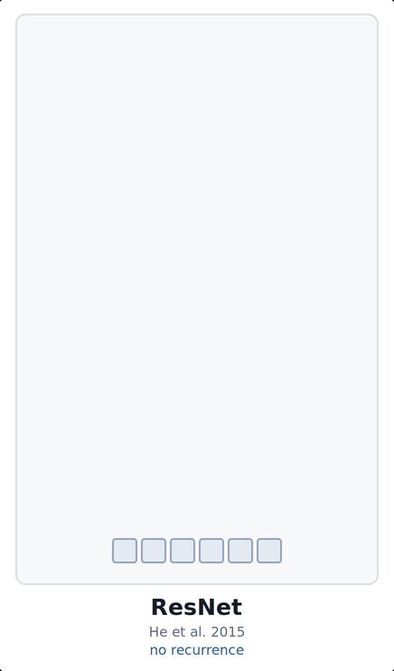
  <figcaption><b>Figure 2: A ResNet has no recurrence.</b> The animation builds the network from the input (bottom) to the output (top). Every block has a different fill pattern, i.e. its own weights, and the forward pass visits each block once. The blocks have the same structure and could share weights, but they do not.</figcaption>
</figure>

## 0.2 Transformer LLMs like GPT, Llama, DeepSeek, etc.
Large language models (LLMs) based on the [Transformer](#ref-transformer), like GPT ([Radford et al., 2018](#ref-gpt); [Brown et al., 2020](#ref-gpt3)), [Llama](#ref-llama), or [DeepSeek](#ref-deepseek), map multiple input tokens $(x^1, \ldots, x^T)$ to one output token $x^{T+1}$. Same as in Section 0.1: the $L$ layers or blocks each have their own weights $w_l$, and the forward pass visits each exactly once (Figure 3). There is no weight sharing across depth and no recurrence.

<figure id="fig-llm">
  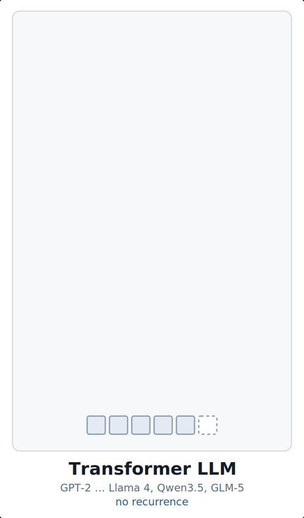
  <figcaption><b>Figure 3: A Transformer LLM is a deep network without recurrence.</b> The input tokens enter at the bottom, and the dashed box is the next token to be predicted. As in the ResNet of Figure 2, each block has its own weights (different fill patterns) and is visited once. This design holds for almost all open-weight LLMs, from GPT-2 to current models.</figcaption>
</figure>

Sebastian Raschka's [LLM architecture gallery](#ref-raschka-gallery) collects over a hundred current open-weight LLMs, from GPT-2 to Llama 3, Qwen3, DeepSeek V3, Gemma, Mistral, GLM, Kimi and OLMo. **Almost all of them fall into this category**: a stack of structurally identical Transformer blocks, each with its own weights, visited exactly once per forward pass. What varies across the gallery is the attention variant (grouped-query attention, multi-head latent attention, sliding-window attention), the placement of the normalization layers, and whether the feed-forward block is dense or a mixture of experts. None of that changes the weight-sharing picture. Even the inter-layer hybrids that swap some attention layers for Mamba-2 or linear-attention layers, such as Nemotron 3 or [Qwen3-Next](#ref-qwen), only add recurrence along time inside individual layers (Section 1.2). Along depth they stay untied.

One caveat, because it causes trouble later. A Transformer *does* share weights across positions: the same projections run at every token. That is weight sharing, but not recurrence: positions are computed in parallel and step $t$ does not consume step $t-1$.

# 1. Recurrence along time


## 1.1 RNNs/LSTM
Recurrent neural networks ([e.g. Elman, 1990](#ref-elman)) apply the recurrence to the hidden representation $h^t$, consuming one sequence element $x^t$ per step:

```math
h^{t+1} = f(h^t, x^t; w)
```

**LSTM** [(Hochreiter & Schmidhuber, 1997)](#ref-lstm) carries a cell state with an additive, ungated path through time, $c^{t+1} = c^t + i^t \odot g^t$, where $i^t$ is the input gate and $g^t$ the cell input. The later forget gate ([Gers et al., 2000](#ref-gers)) made this path gated. Remember this path for the depth section. **LSTMs also powered the first large-scale neural language models** ([Jozefowicz et al., 2016](#ref-jozefowicz)). Figure 4 shows two stacked recurrent layers.

<figure id="fig-rnn">
  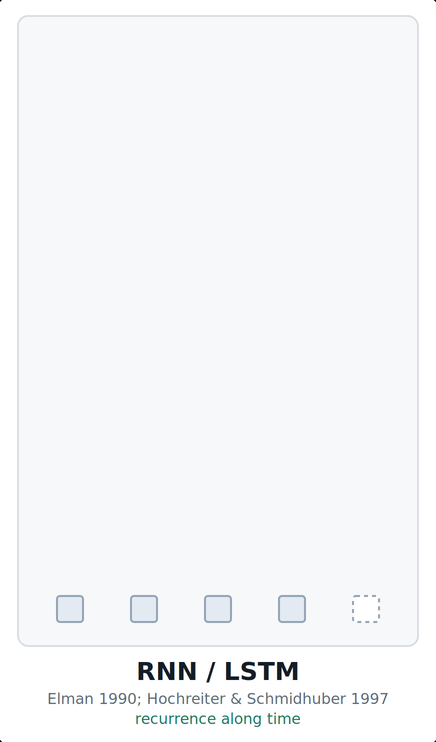
  <figcaption><b>Figure 4: Recurrent networks share weights along time.</b> The first layer (plain cells) reads one token per time step and passes its hidden state to the right. The same cell is applied at every step (×T). A second layer with its own weights (hatched cells) runs on top in the same way. Weights are shared along time, but not between the two layers.</figcaption>
</figure>

## 1.2 Linear-state layers: [mLSTM](#ref-mlstm), [GLA](#ref-gla), [Gated DeltaNet](#ref-gdn), [Mamba](#ref-mamba)

At inference, linear-state layers run like classic RNNs, one step per token, in time linear in the sequence length. Their state update is linear in the state, however. Hence, the updates for all time steps can be computed in parallel during training, e.g. by a parallel scan or in chunks. Their ancestor is the **Fast Weight Programmer** ([Schmidhuber, 1991](#ref-fastweight); [Schlag et al., 2021](#ref-fastweight2)): unnormalised linear attention is, up to notation, a fast-weight memory, and [DeltaNet](#ref-gdn) descends directly from that line. These architectures stack several such layers, and the layers do *not* share weights with each other (Figure 5). The sharing is inside each layer, along time. Some recent LLMs, like [Qwen3-Next](#ref-qwen), are inter-layer hybrids: some linear-state layers, some classic attention layers.

<figure id="fig-linear">
  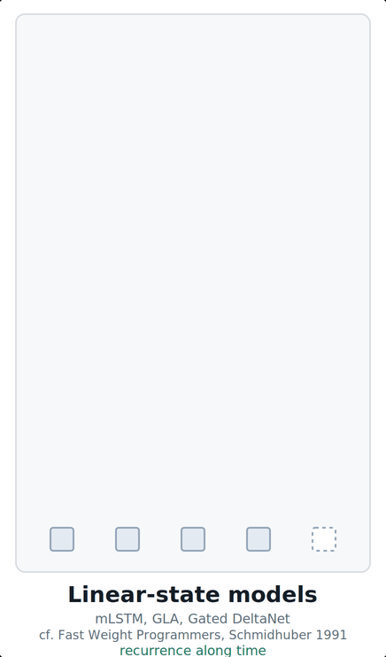
  <figcaption><b>Figure 5: Linear-state layers recur along time, not along depth.</b> Architectures such as mLSTM, gated linear attention, and Gated DeltaNet stack several recurrent layers. Each layer is a loop over time (×T) with its own weights, shown by the three different fill patterns. Unlike in classic RNNs, the linear state update allows the time steps to be computed in parallel during training.</figcaption>
</figure>


## 1.3 Learning to Think [(Schmidhuber 2015, Sec. 5.3)](#ref-ltt)

Learning to Think is an approach in which two RNNs interact, i.e. it uses recurrence along the time axis. It predates latent reasoning by a decade.

<figure id="fig-ltt">
  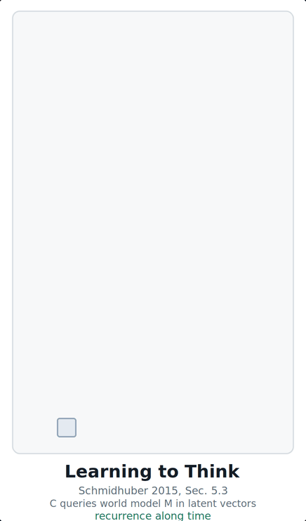
  <figcaption><b>Figure 6: Learning to Think lets a controller query a world model in latent space.</b> The world model M (plain) reads the input and runs over time. The controller C (hatched) runs on top with its own weights and reads the states of M. In the last phase, C sends queries back into M (diagonal arrows) and reads the answers, before C produces the output. Both networks recur along time. They do not share weights with each other, and no step produces text.</figcaption>
</figure>

Two recurrent networks interact, a controller $C$ with state $c^t$ and a world model $M$ with state $m^t$ (Figure 6):

```math
c^{t+1} = f_C(c^t, m^t; w_C)
```

The world model evolves by its own recurrence with weights $w_M$. $C$ learns to send self-generated vector queries into $M$ and read vector answers back, explicitly not in natural language, explicitly to replace millisecond-by-millisecond rollout planning with abstract iteration. Each network shares its own weights across $t$, and they do not share with each other. The sequence being recurred over is internal, not read from the input. This is latent reasoning, i.e. reasoning without emitting tokens, ten years before the term.

# 2. Whole-network recurrence

Whole-network recurrence feeds the output of a neural network back as its next input:

```math
x^{l+1} = F(x^l; w),
```

where $F$ is a whole neural network with weights $w$, and the weights are shared across iterations. Nothing is tied *within* $F$, and its internal layers can be as heterogeneous as you like. What repeats is $F$ entire.


## 2.1 Deep Equilibrium Models [(Bai, Kolter & Koltun 2019)](#ref-deq)

Instead of running the iteration step by step, DEQs solve for the fixed point $z^\star$ directly:

```math
 z^\star = F(z^\star, x; w)
```

with a root-finding algorithm such as Broyden's method. The gradient is computed at the solution via the implicit function theorem. Hence, no iterates are stored, and memory is constant in the number of iterations. Classic GNNs already used fixed-point formulations. DEQ generalized the equilibrium-network perspective and provided a particularly clean implicit-differentiation formulation.

DEQ could also belong to Section 3. The function $F$ can be a whole network, as drawn in Figure 7, or a single weight-tied layer. In the second case, a DEQ is the modern form of the Almeida-Pineda nets of Section 3.2.

<figure id="fig-deq">
  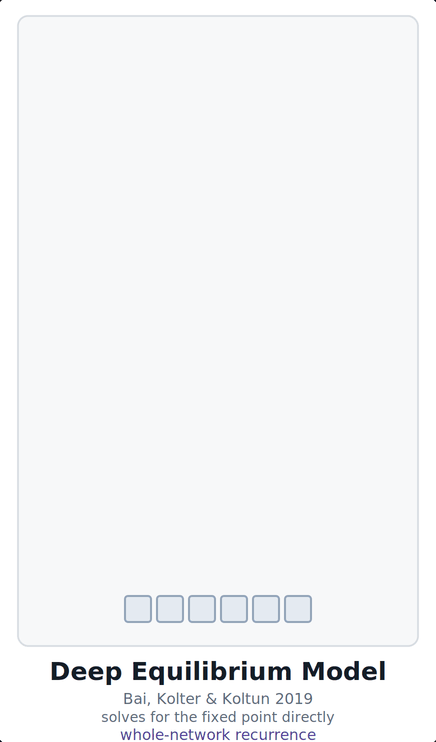
  <figcaption><b>Figure 7: A Deep Equilibrium Model solves for the fixed point of a whole network.</b> The input is injected into every layer (arrows on the left). The network, here three layers with their own weights, is applied again and again (purple frame, ×∞) until its output stops changing, $z^\star = f(z^\star, x)$. A DEQ does not run this loop step by step. Instead, a root-finding algorithm computes the fixed point directly. The same construction with a single tied layer would place the DEQ in Section 3.</figcaption>
</figure>

## 2.2 AlphaFold2 recycling [(Jumper et al., 2021)](#ref-alphafold)

AlphaFold2 runs the entire Evoformer-plus-structure trunk, feeds the predicted structure back in as input, and repeats (Figure 8). At inference, three recycling passes follow the first pass, four passes in total. The internal blocks all have their own weights. It is $F$ as a whole that repeats, while its internal depth is largely untied. During training, the number of passes is sampled at random, and gradients flow only through the last pass.

<figure id="fig-af2">
  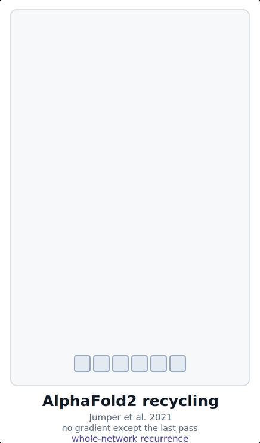
  <figcaption><b>Figure 8: AlphaFold2 recycles its own prediction.</b> The trunk, four blocks with their own weights, produces a structure prediction. The prediction returns as input (arrow on the right), and the whole trunk runs again. At inference, the loop runs four times: one initial pass and three recycling passes. Only the last pass receives gradients during training.</figcaption>
</figure>


## 2.3 Diffusion and Flow Matching ([Ho et al., 2020](#ref-diffusion); [Lipman et al., 2023](#ref-flow))

Both denoising diffusion and flow matching can also be viewed under this perspective: their sampling procedure iteratively uses a forward pass through a whole neural network (Figure 9). One neural network, typically a U-Net or a diffusion Transformer, is re-applied at every denoising or integration step and conditioned on the step index. The step conditioning matters: without it the iterations would be indistinguishable. Unlike AlphaFold2, training never unrolls this chain. Each step is trained separately against a regression target.

<figure id="fig-diff">
  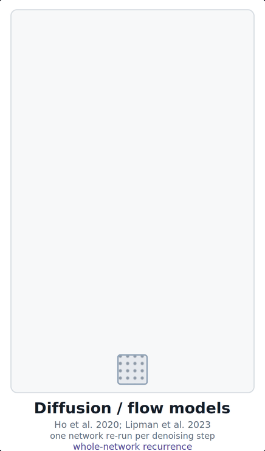
  <figcaption><b>Figure 9: Diffusion and flow matching re-run one network per denoising step.</b> Sampling starts from noise (dotted square). The whole network denoises the sample, and its output is the input of the next step (arrow on the right, ×L steps). The network is conditioned on the step index, which is not drawn. Training never unrolls this loop, since each step is trained separately.</figcaption>
</figure>


# 3. Recurrence along depth
Let us recall the layered structure of deep neural networks (as above): 
```math
 y = f_L( \cdots f_2( f_1(x) )) = f_L \circ \cdots \circ f_2 \circ f_1 (x)
```

Notably, these consecutive layers or blocks in modern architectures often have the same structure and size:
```math
  h^{l+1} = h^l + f_l(h^l; w_l)
```
so different layers could share the same weights $w$. The following architectures do exactly this: different layers or blocks with the same structure use the same set of weights, called *weight sharing*.

Note that the construction of the layers seems to come from ResNets, but originally this is the construction in LSTM: the constant error carousel is the same additive identity path, along time instead of depth. Highway Networks [(Srivastava, Greff & Schmidhuber 2015)](#ref-highway) carried the LSTM gating into the depth dimension explicitly, and ResNet is the ungated special case.


## 3.1 Amari-Hopfield networks
Some of the earliest neural networks we know, [Amari networks](#ref-amari) and [Hopfield networks](#ref-hopfield), already use recurrence: they consist of just one linear layer, followed by the sign function, that is applied until convergence to **binary patterns** (Figure 10). Their state is also their output. Hence, Amari-Hopfield networks are the case in which recurrence along depth and whole-network recurrence coincide.

<figure id="fig-hopfield">
  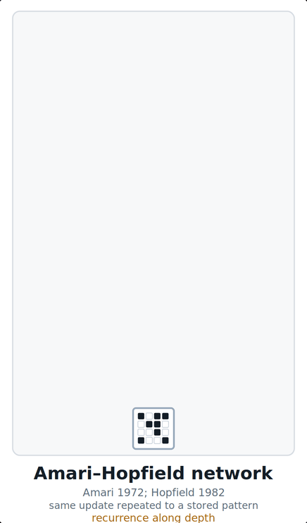
  <figcaption><b>Figure 10: An Amari-Hopfield network repeats one layer until it reaches a stored pattern.</b> A noisy binary pattern (bottom) enters a single layer. The same layer, with the same weights (identical dotted fill), is applied again and again (×L). The state converges to the closest stored pattern (top). This is recurrence along depth in its simplest form: one layer, one set of weights, repeated.</figcaption>
</figure>


## 3.2 Input-constant recurrent neural networks (Almeida-Pineda nets)

**Almeida-Pineda** ([Almeida, 1987](#ref-almeida); [Pineda, 1987](#ref-pineda)) bridges recurrence along time with recurrence along depth. Written out it is

```math
h^{t+1} = f(h^t, x; w)
```

which is the RNN equation with $x^t \equiv x$: the input is clamped, i.e. held constant and injected at every iteration, and the network runs until its state stops changing (Figure 11).

<figure id="fig-icrnn">
  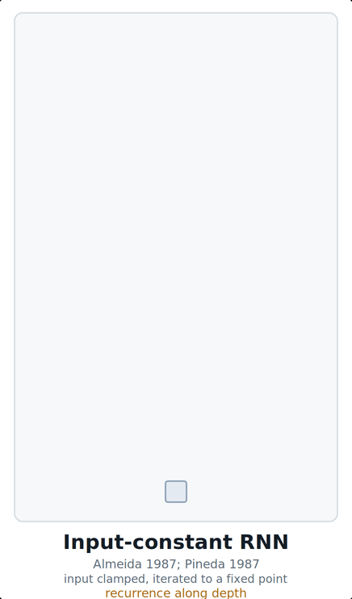
  <figcaption><b>Figure 11: An Almeida-Pineda net injects the constant input at every step.</b> As in Figure 10, one layer with shared weights is repeated (×L) until the state reaches a fixed point. Unlike in Figure 10, the input enters every step (arrows on the left). Without this input injection, the architecture becomes the weight-shared ResNet of Figure 13.</figcaption>
</figure>

The index looks like time, but nothing arrives at each step, so it is refinement rather than time. If $x$ enters only at the first step, the update becomes $h^{l+1} = h^l + K(h^l)$ with $K$ the residual branch. Applied $L$ times, this is the weight-shared ResNet of [Section 3.4](#34-weight-shared-resnet-liao--poggio-2016), and the only difference is whether $x$ is re-injected. Hence, the Almeida-Pineda net can also be viewed as **recurrence along depth**:

```math
h^{l+1} = f(h^l, x; w)
```

## 3.3 Classic graph neural networks [(Scarselli et al. 2009)](#ref-gnn)

Classic graph neural networks (GNNs) apply the same local transition function $f_w$ at every node, over and over, until the node states reach a fixed point (Figure 12). The transition function is constrained to be a contraction, which guarantees a unique fixed point. A readout layer with its own weights maps the final node states to the output. Modern message-passing GNNs, such as graph convolutional networks ([GCN](#ref-kipf)) and graph attention networks ([GAT](#ref-gat)), are the opposite: distinct weights per layer, no recurrence at all.

<figure id="fig-gnn">
  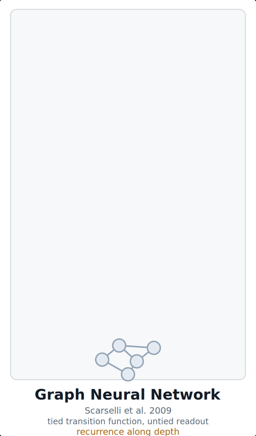
  <figcaption><b>Figure 12: A classic graph neural network iterates one transition function to a fixed point.</b> The input graph enters at the bottom. The same transition function (plain fill) updates all node states, again and again (×L), until they converge. A readout layer with its own weights (grid fill) maps the final node states to the output. Modern message-passing GNNs instead use different weights in every layer.</figcaption>
</figure>

## 3.4 Weight-shared ResNet [(Liao & Poggio 2016)](#ref-poggio)

Liao and Poggio observed that a weight-shared ResNet is exactly a recurrent net with an identity skip: unroll $h^{l+1} = K(h^l) + h^l$ and you get a deep residual stack with tied weights, fold it and you get a shallow RNN. Empirically, 187k shared parameters matched 778k unshared on CIFAR-10, and 8.4M shared came within a couple of points of 29M unshared on ImageNet. Their multi-stage version ties within each stage but not between stages (Figure 13), and they found sharing helped in the first stage and slightly hurt in later ones.

<figure id="fig-resnet-stage">
  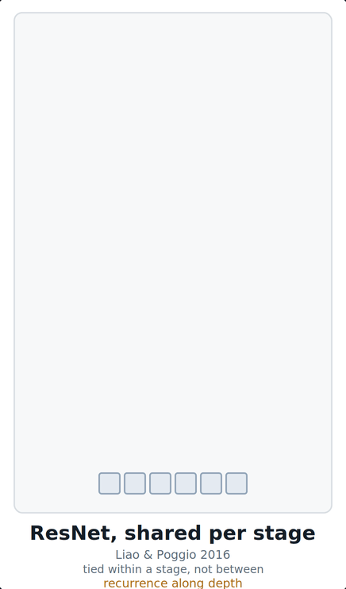
  <figcaption><b>Figure 13: A ResNet with weights shared per stage.</b> The first stage repeats one block (hatched) L times, and the second stage repeats another block (striped) L times. Weights are shared within a stage but not between stages. Liao and Poggio found that sharing helped in the first stage and slightly hurt in later stages.</figcaption>
</figure>

## 3.5 Universal Transformer [(Dehghani et al. 2019)](#ref-ut)

Universal Transformer (UT) ties a single attention-plus-transition block across all steps and adds a timestep embedding at every step, so the iterations are distinguishable (Figure 14). Adaptive computation time ([ACT](#ref-act)) picks the step count per position. **ALBERT** [(Lan et al. 2020)](#ref-albert) uses a similar tying with the count fixed at the layer count and no halting. For several years, ALBERT was the most widely used encoder with shared weights across depth.

<figure id="fig-ut">
  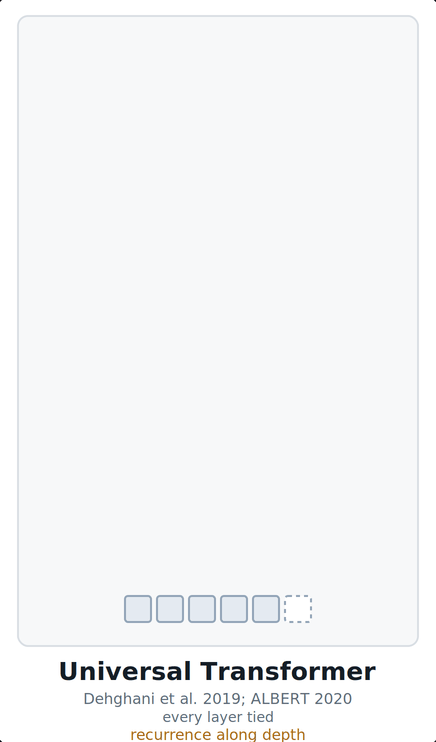
  <figcaption><b>Figure 14: The Universal Transformer shares one block across all depth steps.</b> A single block (hatched) is applied L times to all positions, so every layer has the same weights. A timestep embedding, not drawn, tells the block which step it is on. ALBERT uses the same sharing with a fixed number of steps, while the Universal Transformer can stop per position with adaptive computation time.</figcaption>
</figure>

## 3.6 Looped Transformers ([Giannou et al. 2023](#ref-looped); [Geiping et al. 2025](#ref-geiping))

[Giannou et al. (2023)](#ref-looped) showed that a looped Transformer can emulate a programmable computer. [Geiping et al. (2025)](#ref-geiping) scaled the idea to language models and placed a tied core block $R$ between an untied prelude $P$ and an untied coda $C$ (Figure 15):

```math
   e = P(x),\quad  s^i = R(e, s^{i-1}) \quad \text{for}\ i = 1 \ldots r,  \quad p = C(s^r)
```
$e$ is injected at every iteration, as in Almeida-Pineda nets (Section 3.2) and unlike the weight-shared ResNet (Section 3.4). $r$ is sampled during training and can be turned up at inference. Gradients propagate through only the last $k = 8$ passes.

<figure id="fig-looped">
  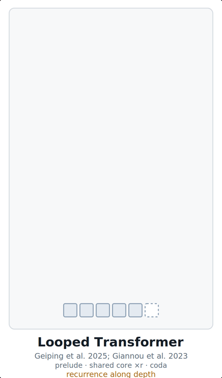
  <figcaption><b>Figure 15: A looped Transformer wraps a shared core in untied layers.</b> A prelude (striped) embeds the input tokens. A core block (hatched) with shared weights is applied r times. A coda (vertical stripes) maps the final state to the output tokens. Prelude and coda have their own weights. The number of loops r is sampled during training and can be increased at inference to spend more compute.</figcaption>
</figure>

## 3.7 Looped language models
**Mixture-of-Recursions** [(Bae et al. 2025)](#ref-dyndepth) is the same shared block with the loop count made per token: a lightweight router assigns each token $t$ its own $r_t$, so easy tokens exit after one pass and hard ones keep going. Like ACT in the Universal Transformer, it chooses the depth per position, but it uses a learned router instead of a halting unit. It comes with a matching key-value cache: only the tokens still active at loop step $i$ have their keys and values stored. It is also the paper Nanbeige cites for its looped architecture, so this is the line that actually reached production.

**In production.** Modern LLMs have many Transformer blocks with the same structure, which makes them ideal candidates for recurrently applying the same block. Until recently, no production decoder LLM did: in the [gallery](#ref-raschka), every block of these stacks, from about 16 to more than 120 blocks, has its own weights, and the spare parameters went into mixture-of-experts, which buys capacity without buying depth. [**Nanbeige4.2-3B**](#ref-nanbeige) broke that, pretrained from scratch on 28T tokens and running its 22-layer stack twice for 44 layers of effective depth from one copy of the weights (Figure 16). Their ablation says two passes were the sweet spot, retaining about 75% of the token efficiency of an untied stack, while three or more bought almost nothing. [**Ouro**](#ref-ouro) does something similar, with deep supervision at every loop end.

<figure id="fig-nanbeige">
  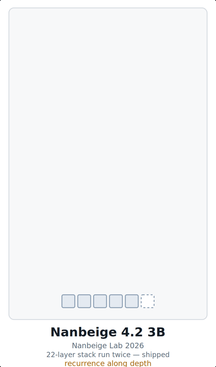
  <figcaption><b>Figure 16: Nanbeige4.2-3B runs its whole layer stack twice.</b> Within one pass, all layers have their own weights, and the three fill patterns stand for the 22 distinct layers. The whole stack is then applied a second time with the same weights (×2). The result is 44 layers of effective depth from 22 layers of weights. According to the authors, more than two passes added almost nothing.</figcaption>
</figure>

**GPT-6 Astra** was [reported](#ref-theinformation) in September 2026 to use a constrained looped architecture (Figure 17), though OpenAI has not confirmed it and the system card says nothing about architecture. If that report is right, the reason to care is not parameter efficiency. A loop that runs in latent space produces reasoning that leaves no token trace. This removes part of what chain-of-thought monitoring, i.e. reading the reasoning tokens of a model, depends on.

<figure id="fig-astra">
  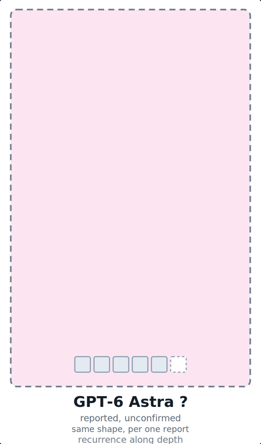
  <figcaption><b>Figure 17: GPT-6 Astra, as one unconfirmed report suggests.</b> The pink background and the question marks indicate that the architecture is speculative. The sketch follows the shape of the looped Transformer in Figure 15: a prelude, a shared core applied an unknown number of times, and a coda. OpenAI has not described the architecture, so this figure shows a hypothesis, not a fact.</figcaption>
</figure>

## 3.8 Fixed point, or fixed count? Truncated backprop or not?

Almeida-Pineda nets, classic GNNs and DEQs run to convergence. AlphaFold2 and looped Transformers run a fixed number of steps. Diffusion also runs a fixed number of steps but avoids the gradient problem, since each step is trained separately. This split cuts across Sections 2 and 3, and it is really a split about gradients.

Running to a fixed point buys you the implicit function theorem: differentiate at the solution, forget the path. Running a fixed count means you either pay memory linear in the number of iterations for backpropagation through the iterations, or you have to approximate. [HRM](#ref-hrm) (Section 4) keeps only the first term of the Neumann series of the implicit gradient, a one-step gradient. [Looped Transformers](#ref-geiping) truncate to the last $k$ passes. [AlphaFold2](#ref-alphafold) switches the gradient off for all passes but the last. Three methods, one problem, three sizes of the same shortcut.

There is also a reason *not* to converge. Once the state stops moving, further iterations do nothing and the useful depth caps out below the nominal one. Whether you want the fixed point or want to stay away from it is the central tension in this whole family.

# 4. Whole-network and depth recurrence: HRM, TRM, SE-RRM

These architectures combine both loops: weight sharing along depth, and repetition of the whole network.

**HRM** [(Wang et al. 2025)](#ref-hrm) has a low-level module $f_\mathrm{L}$ and a high-level module $f_\mathrm{H}$:

```math
\begin{aligned}
z_\mathrm{L}^{i} &= f_\mathrm{L}(z_\mathrm{L}^{i-1}, z_\mathrm{H}^{i-1}, x; w_\mathrm{L}), \\
z_\mathrm{H}^{i} &= \begin{cases} f_\mathrm{H}(z_\mathrm{H}^{i-1}, z_\mathrm{L}^{i}; w_\mathrm{H}) & \text{if } i \bmod T = 0,\\ z_\mathrm{H}^{i-1} & \text{otherwise,}\end{cases}
\qquad i = 1,\ldots,NT.
\end{aligned}
```
Following Wang et al., $T$ is the number of low-level steps per high-level update and $N$ the number of cycles. The upright subscripts L and H name the low-level and the high-level module. $f_\mathrm{L}$ is tied across the $T$ steps inside a cycle, and the pair is repeated for $N$ cycles, that is **depth recurrence** (Figure 18). The whole network is then re-run as a *segment* under deep supervision, with the state detached between segments, that is **whole-network recurrence**. The result is an effective depth of $N \cdot T$ from two weight sets, with 27M parameters and about 1000 training examples per task. The high-level update $z_\mathrm{H}$ can be interpreted as a mechanism that periodically changes the conditioning seen by the low-level loop. This may prevent the low-level loop from simply settling into the same trajectory.

<figure id="fig-hrm">
  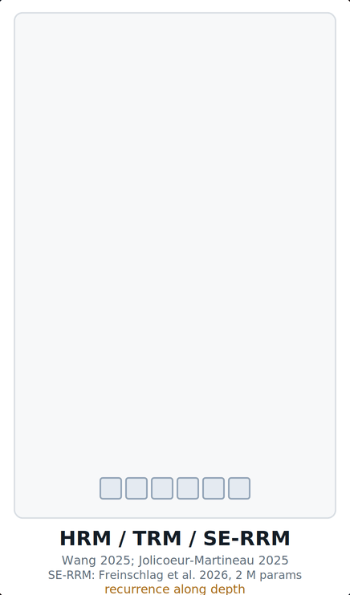
  <figcaption><b>Figure 18: HRM, TRM, and SE-RRM nest two loops.</b> The low-level module L (hatched) is applied several times with shared weights (×L in the figure, $T$ steps in the text). Then the high-level module H (striped) updates once. This cycle repeats N times (purple frame), which gives an effective depth of $N \cdot T$ from two sets of weights. The segment loop, which repeats the whole computation under deep supervision, is not drawn. TRM merges L and H into one network, and SE-RRM adds symbol equivariance with 2M parameters.</figcaption>
</figure>

**TRM** [(Jolicoeur-Martineau 2025)](#ref-trm) then showed the two-module split was not the critical part: one shared network with 7M parameters reaches 44.6% test accuracy on [ARC-AGI-1](#ref-arcagi), compared with 40.3% for HRM. **SE-RRM** [(Freinschlag et al. 2026)](#ref-se-rrm) adds symbol equivariance: a permutation of the input symbols permutes the output symbols in the same way. As a result, the recurrence generalizes to grids and alphabets it never saw. SE-RRM trained on 9×9 Sudoku extrapolates down to 4×4 and up to 16×16 and 25×25 with 2M parameters. **A new axis of weight sharing, aside from time and depth: symbols.**

This leaves the field in an odd place. **The smallest neural networks here are getting the most out of recurrence, and the largest are only now starting to employ recurrence.**


# References

- <a id="ref-schmidhuber2015"></a> Schmidhuber, J. (2015). Deep learning in neural networks: An overview. *Neural Networks* 61, 85–117. [doi:10.1016/j.neunet.2014.09.003](https://doi.org/10.1016/j.neunet.2014.09.003) · [arXiv:1404.7828](https://arxiv.org/abs/1404.7828)
- <a id="ref-snn"></a> Klambauer, G., Unterthiner, T., Mayr, A., & Hochreiter, S. (2017) Self-Normalizing Neural Networks. *NeurIPS* [https://proceedings.neurips.cc/paper_files/paper/2017/hash/5d44ee6f2c3f71b73125876103c8f6c4-Abstract.html](https://proceedings.neurips.cc/paper_files/paper/2017/hash/5d44ee6f2c3f71b73125876103c8f6c4-Abstract.html)
- <a id="ref-highway"></a> Srivastava, R. K., Greff, K., & Schmidhuber, J. (2015). Highway networks. *ICML Deep Learning Workshop*. [arXiv:1505.00387](https://arxiv.org/abs/1505.00387)
- <a id="ref-resnet"></a> He, K., Zhang, X., Ren, S., & Sun, J. (2016). Deep residual learning for image recognition. *CVPR*, 770–778. [arXiv:1512.03385](https://arxiv.org/abs/1512.03385)
- <a id="ref-transformer"></a> Vaswani, A., Shazeer, N., Parmar, N., Uszkoreit, J., Jones, L., Gomez, A. N., Kaiser, Ł., & Polosukhin, I. (2017). Attention is all you need. *NeurIPS 30*. [arXiv:1706.03762](https://arxiv.org/abs/1706.03762)
- <a id="ref-gpt"></a> Radford, A., Narasimhan, K., Salimans, T., & Sutskever, I. (2018). Improving language understanding by generative pre-training. OpenAI technical report.
- <a id="ref-gpt3"></a> Brown, T. B., et al. (2020). Language models are few-shot learners. *NeurIPS 33*. [arXiv:2005.14165](https://arxiv.org/abs/2005.14165)
- <a id="ref-llama"></a> Touvron, H., et al. (2023). LLaMA: Open and efficient foundation language models. [arXiv:2302.13971](https://arxiv.org/abs/2302.13971)
- <a id="ref-raschka-gallery"></a> Raschka, S. (2026). *LLM Architecture Gallery*. [sebastianraschka.com/llm-architecture-gallery](https://sebastianraschka.com/llm-architecture-gallery/)
- <a id="ref-deepseek"></a> DeepSeek-AI (2024). DeepSeek-V3 technical report. [arXiv:2412.19437](https://arxiv.org/abs/2412.19437)
- <a id="ref-amari"></a> Amari, S.-I. (1972). Learning patterns and pattern sequences by self-organizing nets of threshold elements. *IEEE Transactions on Computers* C-21(11), 1197–1206. [doi:10.1109/T-C.1972.223477](https://doi.org/10.1109/T-C.1972.223477)
- <a id="ref-hopfield"></a> Hopfield, J. J. (1982). Neural networks and physical systems with emergent collective computational abilities. *PNAS* 79(8), 2554–2558. [doi:10.1073/pnas.79.8.2554](https://doi.org/10.1073/pnas.79.8.2554)
- <a id="ref-elman"></a> Elman, J. L. (1990). Finding structure in time. *Cognitive Science* 14(2), 179–211. [doi:10.1207/s15516709cog1402_1](https://doi.org/10.1207/s15516709cog1402_1)
- <a id="ref-lstm"></a> Hochreiter, S., & Schmidhuber, J. (1997). Long short-term memory. *Neural Computation* 9(8), 1735–1780. [doi:10.1162/neco.1997.9.8.1735](https://doi.org/10.1162/neco.1997.9.8.1735)
- <a id="ref-gers"></a> Gers, F. A., Schmidhuber, J., & Cummins, F. (2000). Learning to forget: Continual prediction with LSTM. *Neural Computation* 12(10), 2451–2471. [doi:10.1162/089976600300015015](https://doi.org/10.1162/089976600300015015)
- <a id="ref-jozefowicz"></a> Jozefowicz, R., Vinyals, O., Schuster, M., Shazeer, N., & Wu, Y. (2016). Exploring the limits of language modeling. [arXiv:1602.02410](https://arxiv.org/abs/1602.02410)
- <a id="ref-fastweight"></a> Schmidhuber, J. (1991). Learning to control fast-weight memories: An alternative to recurrent nets. Technical Report FKI-147-91, Institut für Informatik, TU München. Published as: Schmidhuber, J. (1992). Learning to control fast-weight memories: An alternative to dynamic recurrent networks. *Neural Computation* 4(1), 131–139. [doi:10.1162/neco.1992.4.1.131](https://doi.org/10.1162/neco.1992.4.1.131)
- <a id="ref-fastweight2"></a> Schlag, I., Irie, K., & Schmidhuber, J. (2021). Linear Transformers are secretly fast weight programmers. *ICML*. [arXiv:2102.11174](https://arxiv.org/abs/2102.11174)
- <a id="ref-mamba"></a> Gu, A., & Dao, T. (2023). Mamba: Linear-time sequence modeling with selective state spaces. *COLM 2024*. [arXiv:2312.00752](https://arxiv.org/abs/2312.00752)
- <a id="ref-gla"></a> Yang, S., Wang, B., Shen, Y., Panda, R., & Kim, Y. (2024). Gated linear attention Transformers with hardware-efficient training. *ICML*. [arXiv:2312.06635](https://arxiv.org/abs/2312.06635)
- <a id="ref-mlstm"></a> Beck, M., Pöppel, K., Spanring, M., Auer, A., Prudnikova, O., Kopp, M., Klambauer, G., Brandstetter, J., & Hochreiter, S. (2024). xLSTM: Extended long short-term memory (mLSTM / sLSTM). *NeurIPS 37*. [arXiv:2405.04517](https://arxiv.org/abs/2405.04517)
- <a id="ref-gdn"></a> Yang, S., Kautz, J., & Hatamizadeh, A. (2025). Gated Delta Networks: Improving Mamba2 with delta rule. *ICLR*. [arXiv:2412.06464](https://arxiv.org/abs/2412.06464)
- <a id="ref-qwen"></a> Qwen Team (2025). Qwen3 technical report. [arXiv:2505.09388](https://arxiv.org/abs/2505.09388) · [Qwen3-Next-80B-A3B model card](https://huggingface.co/Qwen/Qwen3-Next-80B-A3B-Instruct).
- <a id="ref-ltt"></a> Schmidhuber, J. (2015). On learning to think: Algorithmic information theory for novel combinations of reinforcement learning controllers and recurrent neural world models. [arXiv:1511.09249](https://arxiv.org/abs/1511.09249) (recurrent controller–world-model interaction is Sec. 5.3)
- <a id="ref-almeida"></a> Almeida, L. B. (1987). A learning rule for asynchronous perceptrons with feedback in a combinatorial environment. *Proceedings of the IEEE First International Conference on Neural Networks*, vol. 2, 609–618.
- <a id="ref-pineda"></a> Pineda, F. J. (1987). Generalization of back-propagation to recurrent neural networks. *Physical Review Letters* 59(19), 2229–2232. [doi:10.1103/PhysRevLett.59.2229](https://doi.org/10.1103/PhysRevLett.59.2229)
- <a id="ref-gnn"></a> Scarselli, F., Gori, M., Tsoi, A. C., Hagenbuchner, M., & Monfardini, G. (2009). The graph neural network model. *IEEE Transactions on Neural Networks* 20(1), 61–80. [doi:10.1109/TNN.2008.2005605](https://doi.org/10.1109/TNN.2008.2005605)
- <a id="ref-kipf"></a> Kipf, T. N., & Welling, M. (2017). Semi-supervised classification with graph convolutional networks. *ICLR*. [arXiv:1609.02907](https://arxiv.org/abs/1609.02907)
- <a id="ref-gat"></a> Veličković, P., Cucurull, G., Casanova, A., Romero, A., Liò, P., & Bengio, Y. (2018). Graph attention networks. *ICLR*. [arXiv:1710.10903](https://arxiv.org/abs/1710.10903)
- <a id="ref-deq"></a> Bai, S., Kolter, J. Z., & Koltun, V. (2019). Deep equilibrium models. *NeurIPS 32*. [arXiv:1909.01377](https://arxiv.org/abs/1909.01377)
- <a id="ref-alphafold"></a> Jumper, J., et al. (2021). Highly accurate protein structure prediction with AlphaFold. *Nature* 596, 583–589. [doi:10.1038/s41586-021-03819-2](https://doi.org/10.1038/s41586-021-03819-2)
- <a id="ref-diffusion"></a> Ho, J., Jain, A., & Abbeel, P. (2020). Denoising diffusion probabilistic models. *NeurIPS 33*. [arXiv:2006.11239](https://arxiv.org/abs/2006.11239)
- <a id="ref-flow"></a> Lipman, Y., Chen, R. T. Q., Ben-Hamu, H., Nickel, M., & Le, M. (2023). Flow matching for generative modeling. *ICLR*. [arXiv:2210.02747](https://arxiv.org/abs/2210.02747)
- <a id="ref-ut"></a> Dehghani, M., Gouws, S., Vinyals, O., Uszkoreit, J., & Kaiser, Ł. (2019). Universal Transformers. *ICLR*. [arXiv:1807.03819](https://arxiv.org/abs/1807.03819)
- <a id="ref-act"></a> Graves, A. (2016). Adaptive computation time for recurrent neural networks. [arXiv:1603.08983](https://arxiv.org/abs/1603.08983)
- <a id="ref-albert"></a> Lan, Z., Chen, M., Goodman, S., Gimpel, K., Sharma, P., & Soricut, R. (2020). ALBERT: A lite BERT for self-supervised learning of language representations. *ICLR*. [arXiv:1909.11942](https://arxiv.org/abs/1909.11942)
- <a id="ref-poggio"></a> Liao, Q., & Poggio, T. (2016). Bridging the gaps between residual learning, recurrent neural networks and visual cortex. CBMM Memo No. 047. [arXiv:1604.03640](https://arxiv.org/abs/1604.03640)
- <a id="ref-looped"></a> Giannou, A., Rajput, S., Sohn, J.-y., Lee, K., Lee, J. D., & Papailiopoulos, D. (2023). Looped Transformers as programmable computers. *ICML*, 11398–11442. [arXiv:2301.13196](https://arxiv.org/abs/2301.13196)
- <a id="ref-geiping"></a> Geiping, J., McLeish, S., Jain, N., Kirchenbauer, J., Singh, S., Bartoldson, B. R., Kailkhura, B., Bhatele, A., & Goldstein, T. (2025). Scaling up test-time compute with latent reasoning: A recurrent depth approach ("Huginn"). *NeurIPS 38*. [arXiv:2502.05171](https://arxiv.org/abs/2502.05171)
- <a id="ref-dyndepth"></a> Bae, S., Kim, Y., Bayat, R., Kim, S., Ha, J., Schuster, T., Fisch, A., Harutyunyan, H., Ji, Z., Courville, A., & Yun, S.-Y. (2025). Mixture-of-Recursions: Learning dynamic recursive depths for adaptive token-level computation. *NeurIPS 38*. [arXiv:2507.10524](https://arxiv.org/abs/2507.10524)
- <a id="ref-ouro"></a> Zhu, R.-J., et al. (2025). Scaling latent reasoning via looped language models (Ouro / LoopLM). [arXiv:2510.25741](https://arxiv.org/abs/2510.25741) · [ouro-llm.github.io](https://ouro-llm.github.io)
- <a id="ref-nanbeige"></a> Nanbeige Team (2026). Nanbeige4.2-3B: Unlocking agentic capabilities in a compact model. [arXiv:2607.22083](https://arxiv.org/abs/2607.22083)
- <a id="ref-raschka"></a> Raschka, S. (2026). Looped depth sharing. *LLM Architecture Gallery*. [sebastianraschka.com/llm-architecture-gallery/looped-depth-sharing](https://sebastianraschka.com/llm-architecture-gallery/looped-depth-sharing/)
- <a id="ref-theinformation"></a> *The Information* (1 September 2026). Report that OpenAI's Astra uses a constrained form of "recurrent depth". Not confirmed by OpenAI; the GPT-6 Astra system card does not name the architecture. See also Raschka, S. (2026), [GPT-6 Astra, looped Transformers, and hidden reasoning](https://sebastianraschka.com/blog/2026/openai-astra-looped-transformers.html).
- <a id="ref-hrm"></a> Wang, G., Li, J., Sun, Y., Chen, X., Liu, C., Wu, Y., Lu, M., Song, S., & Abbasi Yadkori, Y. (2025). Hierarchical Reasoning Model. [arXiv:2506.21734](https://arxiv.org/abs/2506.21734) · [github.com/sapientinc/HRM](https://github.com/sapientinc/HRM)
- <a id="ref-trm"></a> Jolicoeur-Martineau, A. (2025). Less is more: Recursive reasoning with tiny networks (TRM). [arXiv:2510.04871](https://arxiv.org/abs/2510.04871)
- <a id="ref-se-rrm"></a> Freinschlag, R., Bertram, T., Kobler, E., Mayr, A., & Klambauer, G. (2026). Symbol-equivariant recurrent reasoning models.  *ICML 2026*. [arXiv:2603.02193](https://arxiv.org/abs/2603.02193) · [github.com/ml-jku/SE-RRM](https://github.com/ml-jku/SE-RRM)
- <a id="ref-arcagi"></a> Chollet, F. (2019). On the measure of intelligence (introduces ARC, now ARC-AGI-1). [arXiv:1911.01547](https://arxiv.org/abs/1911.01547)
